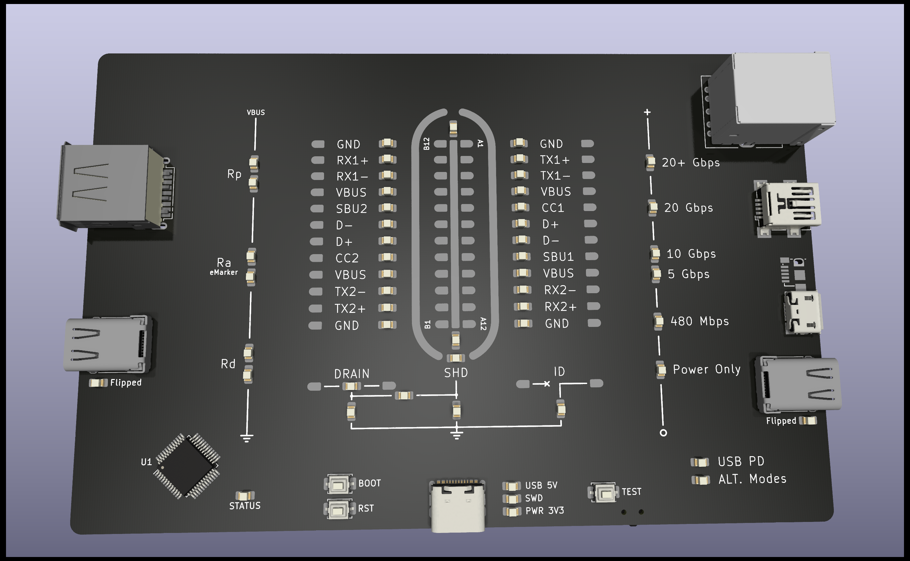

# Overkill USB Cable Tester

[Post on Reddit](https://www.reddit.com/r/PCB/comments/1lwca66/review_request_overkill_usb_tester/?utm_source=share&utm_medium=web3x&utm_name=web3xcss&utm_term=1&utm_content=share_button)

Disclaimer: Work in Progress! Do not expect the current version to work as intended!

**tl;dr:** Designed my second ever PCB and want some suggestions for potential improvements or problems / errors in my design (PCB not routed yet). See questions down below (last paragraph).

Yes, this design is complete overkill! This PCB is mostly for me to try stuff out and intentionally not cost-optimised. That said, should you see improvements without reducing the feature set, go ahead!

## Questions

Some of my most pressing questions are:

- **Will the LED Matrix work** with the two SN74HC595s? (see paragraph "Indicator LED Matrix" below)
- **How does the double mapping of Pin PA14 work?** (BOOT0 & SWCLK) What do I have to do in order to use it in either function? (-> paragraph "SWD" below)
- **Does the back-feed protection work the way I intend it to?** (-> paragraph "Power" below)
- **Is there something I should have done differently regarding the USB-C of the UART controller?** Anything wrong with the ESD protection or shield filtering I put there? (see schematic image 3)
- **Do I need series resistors on the SWD lines?** They are supposed to act as noise suppression to reduce ringing and stuff. Are they good to have or unnecessary? (see R10, R11, R12)

Again, I know the design is complete overkill but suggestions for more elegant solutions are more than welcome!

## Detailed Info

I wanted to have a USB Tester for a long time and thought instead of buying one I'd seize the opportunity to learn some things about PCB design and USB-C. As stated above, this is my second ever PCB design and I originally have a background in IT not EE so expect some rookie mistakes! What started out as a simple "put current through to light some LEDs" turned into "i definitely want cross wire and short detection and want to read out eMarkers and everything".

### Basic working principle

I have two sides: Side A (left side) and Side B (right side). If you plug in a cable (one end into each side) the tester should check which pins are connected and which aren't, which are connected even though they shouldn't and so on. I do this by applying a voltage to each pin after another on the A-Side (s. Output Drivers SN74HC595) and checking which pins get pulled high on the opposing Side B (s. Input Drivers SN74HC165).

#### Detailed working principle

Below I will go into detail on the individual sections of the schematic and my reasoning behind some things.

#### µC - STM32

The controller IC is an STM32 G071CBT6.

##### USB PD

I chose that controller specifically due to its build-in USB PD Communication Chip. I want to use it to read out the eMarkers of USB C Cables to be able to check the cables current and speed rating and potential USB Alt modes.

You may notice that I put the CC1 and CC2 lines of both side on a separate USB PD Controller as well as on ADC pins (12-15). I did this so that i could check for built-in pull-up and pull-down resistors inside the cable (which some cables must include in order to be up to spec).

##### Programming

To program the µC I implemented two methods: UART and SWD.

**SWD**

SWD itself seems to be quite simple from my understanding. I broke out the necessary pins to an appropriate connector (J1). The information I found only does however raise some questions regarding series resistors (see questions section down below).

Furthermore, the STM32 I choose uses the SWCLK pin as the BOOT0 pin as well (Alternate Mode). I could not yet find out how that is supposed to work. Therefore I opted to place a jumper (JP7) to either connect to the BOOT push button (SW4) or to the SWD connector (J1).

**UART**

Because I wanted to try it out, in addition to the SWD interface I used a serial to USB converter (U3 CH340X) to program the µC via USB and to be able to implement serial log to a PC for more detailed test reports.

Again, it was not clear to me how to connect the RST and BOOT0 pins exactly so I placed two solder jumper (JP5/6) to be able to easily change the pin mapping while testing.

#### Indicator LED Matrix

Well...the number of LEDs got a bit out of hand... So I decided to use a matrix powered by two SN74HC595 tri-state shift registers. Partly I did this to limit the number of shift registers needed but partly because I wanted to try it, which seems to be the theme of this build.

#### Power

With the external SWD and USB inputs I expanded the power circuit (which is probably a good thing should the CR2032 prove to be insufficient). The power circuit is designed around a buck converter to step down the external supply voltage (5V USB) down to 3.3V.

Since the µC will happily run with less then 2.5V so the voltage drop that will occur when feeding the buck converter with 3.3V from the SWD interface should be a non-issue but if the buck converter fail, I can still bridge that (JP3) and feed the board directly.

I implemented back-feed protection so that if external power is provided, it does not apply a potentially higher positive voltage to the battery and cuts it off. Here I wanted to avoid a voltage drop of 300mV so I used a MOSFET instead.

#### Test Points

I had that idea about the board design you can see in the images. To pull that off I designed a custom multi-part symbol and footprint.

In the fourth image you can see that I labeled the different test-points. Essentially the PCB Design doubles as test points. Each pin of the USB-C graphic in the centre of the PCB is a test point for that appropriate pin. Since each pin exists on both sides but the graphics only provides one pad per pin, I added a second test point for each pin. For example, if you would want to test for continuity between Pin B12 (upmost left pin) with a multimeter, you would test between the upper left test point left from GND label and the B12 pin inside the graphics.

Again, I tried to show this in the fourth image I hope that makes it more clear.

#### Unpopulated Parts

You may have noticed some unpopulated parts on my PCB. In the case of pull-up or down resistors those are mainly there as placeholders in case I need them but according to the datasheets I shouldn't need them.

The series resistors on the SWD lines are supposed to be noise suppression resistors? I am quite unsure if they are necessary (see question in the questions section).

And that's about it I guess!

## Improvements for the next Revision

### STM32 with USB 2.0 build in

To replace the external UART Bridge that presents a COM port for programming via USB and for serial out, a different MCU could be used with built-in USB 2.0 support instead. This has multiple advantages:

- reducing number of parts (smaller BOM)
  
- broader feature set (debugging/virtual network adapter via USB, which could be used for running a web server hosting a website https://github.com/fetisov/lrndis, https://www.youtube.com/watch?v=hsqWIqY8b6A), (it also makes web flashing possible through WebUSB https://github.com/siliconwitchery/web-stm32-updater), (of course, serial communication is also an option via CDC https://wiki.st.com/stm32mcu/wiki/Introduction_to_USB_with_STM32)
  

The STM32G0 series seems the be the best suited one, as it features two USB-C PD interfaces (UCPD1/2). These are used for checking for eMarkers on both USB-C receptacles (Side A and B). One could argue that only one UCPD interface is needed since eMarkers can be read out from either side of the cable. For USB-C to C and also USB-C to A cables this would work fine. The UCPD interface would be connected to the B-Side receptacle and read out any eMarker in the cable (A-Side would not work for USB-C to A cables, which are Plugged in to the B-Side Type C receptacle, not the A-Side one).

For cables like USB-C to Micro-B this would however not work.

## License

This project is licensed under the

[Creative Commons Attribution-NonCommercial-ShareAlike 4.0 International License](https://creativecommons.org/licenses/by-nc-sa/4.0/).

Copyright (c) 2025 by the original creator and author (GitHub: [thamow](https://github.com/thamow))

Attribution required. Commercial use not permitted. Derivatives must be shared under the same license.

